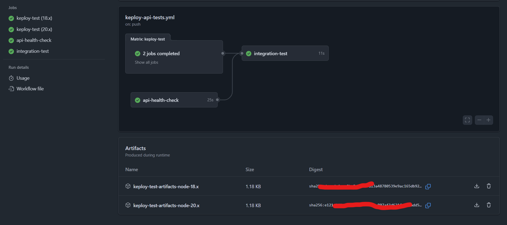

# 📚 Book API - RESTful API with Keploy Testing

<p align="center">
  
</p>

A modern Node.js/Express REST API for managing books with comprehensive Keploy API testing integration.

[](.github/workflows/keploy-api-tests.yml)
[](https://nodejs.org/)
[](https://expressjs.com/)
[](./LICENSE)

## 🚀 Features

- **Complete CRUD Operations**: Create, Read, Update, Delete books
- **Advanced Search**: Search books by title, author, or genre
- **Data Validation**: ISBN format validation and required field checks
- **Error Handling**: Comprehensive error responses with proper HTTP status codes
- **API Documentation**: OpenAPI 3.0 specification included
- **Automated Testing**: Keploy integration for recording and replaying API tests
- **CI/CD Ready**: GitHub Actions workflow for continuous testing

## 📊 Test Results



✅ **All tests passed successfully!** The GitHub Actions workflow completed with:
- **keploy-test (18.x)** - ✅ Completed  
- **keploy-test (20.x)** - ✅ Completed
- **api-health-check** - ✅ Completed (25s)
- **integration-test** - ✅ Completed (11s)
- **Test artifacts generated** for both Node.js versions

**Latest Test Status**: [](.github/workflows/keploy-api-tests.yml)

## 🛠️ API Endpoints

| Method | Endpoint | Description |
|--------|----------|-------------|
| GET | `/api/books` | Get all books |
| POST | `/api/books` | Create a new book |
| GET | `/api/books/{id}` | Get book by ID |
| PUT | `/api/books/{id}` | Update book by ID |
| DELETE | `/api/books/{id}` | Delete book by ID |
| GET | `/api/books/search/{query}` | Search books |

## 🚦 Quick Start

### Prerequisites
- Node.js (18.x or 20.x)
- npm or yarn

### Installation

```bash
# Clone the repository
git clone <repository-url>
cd bookAPI

# Install dependencies
npm install

# Start the server
npm start
```

The API will be available at `http://localhost:3000`

### 🎯 Testing with cURL

```bash
# Get all books
curl -X GET "http://localhost:3000/api/books"

# Create a new book
curl -X POST "http://localhost:3000/api/books" \
  -H "Content-Type: application/json" \
  -d '{"title":"The Great Gatsby","author":"F. Scott Fitzgerald","genre":"Fiction","publishedYear":1925}'

# Search books
curl -X GET "http://localhost:3000/api/books/search/gatsby"
```

See [API_ENDPOINTS.md](./API_ENDPOINTS.md) for complete endpoint documentation with examples.

## 🧪 Keploy Testing

This project uses [Keploy](https://keploy.io) for automated API testing. Keploy records real API calls and replays them as tests.

### Running Tests Locally

```bash
# Install Keploy (Linux/MacOS)
curl --silent -O -L https://keploy.io/install.sh && source install.sh

# Record API tests
keploy record -c "npm start"

# Run recorded tests
keploy test -c "npm start" --delay 10
```

> **Note**: On Windows, use the [dockerized version](https://keploy.io/docs/quickstart/run-your-first-app-tutorial/) of Keploy.

### 🔄 Automated Testing

The project includes a comprehensive GitHub Actions workflow that:

- **Runs on multiple Node.js versions** (18.x, 20.x)
- **Records API interactions** with Keploy
- **Validates all endpoints** with success and error scenarios
- **Generates test reports** and artifacts
- **Performs health checks** to ensure API reliability

**View the workflow**: [`.github/workflows/keploy-api-tests.yml`](.github/workflows/keploy-api-tests.yml)

The workflow automatically runs on:
- Push to `main` or `develop` branches
- Pull requests to `main` or `develop` branches
- Manual trigger via `workflow_dispatch`

## 📋 Data Model

### Book Object
```json
{
  "id": "string (UUID)",
  "title": "string (required)",
  "author": "string (required)",
  "isbn": "string (optional, ISBN-10/13 format)",
  "genre": "string (optional)",
  "publishedYear": "number (optional)",
  "description": "string (optional)",
  "createdAt": "string (ISO date)",
  "updatedAt": "string (ISO date)"
}
```

## 📄 Documentation

- **[API Endpoints](./API_ENDPOINTS.md)** - Complete endpoint reference with cURL examples
- **[API Documentation](./API_DOCUMENTATION.md)** - Detailed usage guide
- **[OpenAPI Specification](./openapi.yaml)** - Machine-readable API specification
- **[Workflow Verification](./WORKFLOW_VERIFICATION.md)** - Testing workflow details

## 🏗️ Project Structure

```
bookAPI/
├── server.js              # Main application server
├── books.json             # Data storage (JSON file)
├── public/                # Frontend assets
│   ├── index.html         # Web interface
│   ├── style.css          # Styling
│   └── script.js          # Client-side JavaScript
├── .github/workflows/     # GitHub Actions
│   └── keploy-api-tests.yml
├── __tests__/            # Test files
├── coverage/             # Test coverage reports
└── docs/                 # Documentation files
```

## 🔧 Configuration

### Environment Variables
- `PORT` - Server port (default: 3000)
- `NODE_ENV` - Environment (development/test/production)

### Keploy Configuration
The project includes a `keploy.yml` configuration file for customizing Keploy behavior.

## 🚀 Deployment

The API is designed to be easily deployable to:
- **Heroku** - Include `Procfile` for web process
- **AWS/GCP/Azure** - Container-ready with Docker support
- **Vercel/Netlify** - Serverless deployment compatible

## 🤝 Contributing

1. Fork the repository
2. Create a feature branch (`git checkout -b feature/amazing-feature`)
3. Commit your changes (`git commit -m 'Add amazing feature'`)
4. Push to the branch (`git push origin feature/amazing-feature`)
5. Open a Pull Request

## 📝 License

This project is licensed under the MIT License - see the [LICENSE](LICENSE) file for details.

## 🙋‍♀️ Support

- **Issues**: [GitHub Issues](https://github.com/galax/bookAPI/issues)
- **Keploy Community**: [](https://join.slack.com/t/keploy/shared_invite/zt-357qqm9b5-PbZRVu3Yt2rJIa6ofrwWNg)

---

<p align="center">
  <b>⚡ Powered by Keploy - API tests faster than unit tests, from user traffic ⚡</b>
</p>
